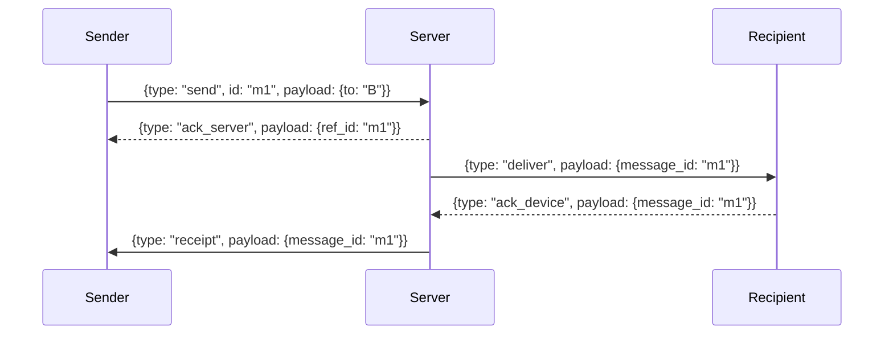
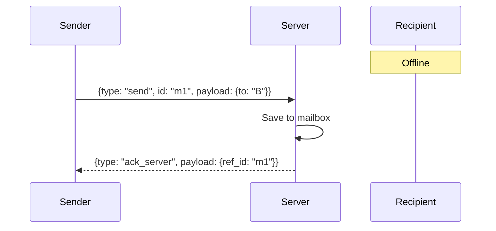
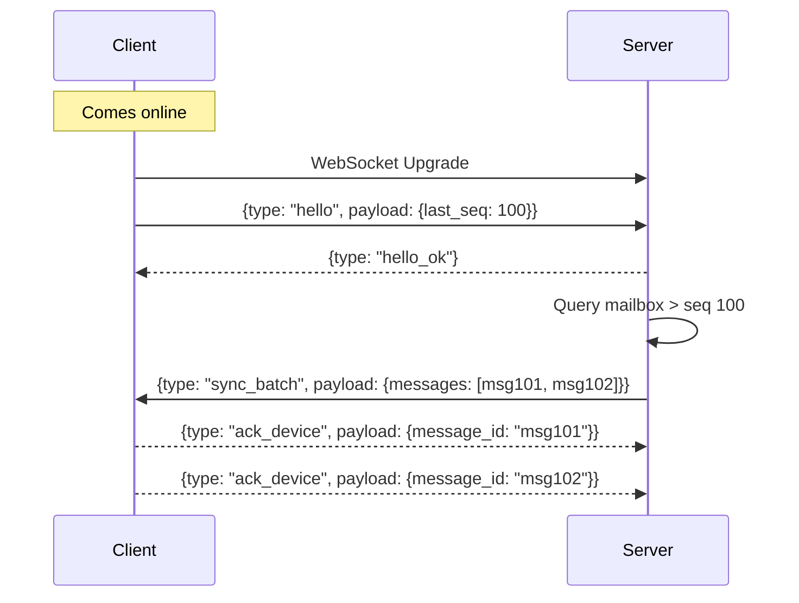

# Realtime Protocol Reference

This document defines the WebSocket-based realtime protocol for the offline message delivery system. It covers frame structures, message types, reliability guarantees, state machine transitions, and connection lifecycle flows.

## 1. Frame Envelope

Every message sent over the WebSocket connection (both client-to-server and server-to-client) MUST conform to the standard frame envelope:

```json
{
  "type": "string",
  "id": "string",
  "ts": "string (ISO8601)",
  "payload": "object"
}
```

- `type`: The message type (e.g., `send`, `hello`).
- `id`: A unique identifier for the frame (typically a UUID).
- `ts`: Timestamp in ISO8601 format when the frame was generated.
- `payload`: Type-specific data object.

## 2. Message Type Table

| Type | Direction | Description |
|---|---|---|
| `hello` | C → S | Initial handshake from client, includes last sequence processed. |
| `hello_ok` | S → C | Server acknowledges handshake. |
| `send` | C → S | Client sends a new message to a recipient. |
| `ack_server` | S → C | Server acknowledges receipt of a `send` message (✓). |
| `deliver` | S → C | Server delivers a message to the target client. |
| `ack_device` | C → S | Target client acknowledges receipt of a `deliver` message. |
| `receipt` | S → C | Server forwards the `ack_device` back to the original sender (✓✓). |
| `read` | C → S / S → C | Read receipt. Client sends when read, server forwards to sender (blue ✓✓). |
| `sync_batch` | S → C | Server sends a batch of missed messages during reconnect. |
| `presence` | S → C | Server broadcasts online/offline status changes. |
| `device_joined` | S → C | Server broadcasts when a new device is registered. |
| `ping` | C → S / S → C | Heartbeat ping. |
| `pong` | C → S / S → C | Heartbeat pong in response to ping. |
| `error` | S → C | Server reports an error to the client. |

## 3. Payload Schemas & Examples

### `hello`
Client provides its authentication context and last known sequence to initiate state sync.
```json
{
  "type": "hello",
  "id": "msg-001",
  "ts": "2026-10-01T10:00:00Z",
  "payload": {
    "device_id": "dev-123",
    "last_seq": 1045
  }
}
```

### `hello_ok`
```json
{
  "type": "hello_ok",
  "id": "srv-001",
  "ts": "2026-10-01T10:00:01Z",
  "payload": {
    "connection_id": "conn-xyz",
    "server_time": "2026-10-01T10:00:01Z"
  }
}
```

### `send`
```json
{
  "type": "send",
  "id": "msg-002",
  "ts": "2026-10-01T10:05:00Z",
  "payload": {
    "to": "dev-456",
    "text": "Hello there!"
  }
}
```

### `ack_server`
```json
{
  "type": "ack_server",
  "id": "srv-002",
  "ts": "2026-10-01T10:05:00.100Z",
  "payload": {
    "ref_id": "msg-002"
  }
}
```

### `deliver`
```json
{
  "type": "deliver",
  "id": "srv-003",
  "ts": "2026-10-01T10:05:00.150Z",
  "payload": {
    "message_id": "msg-002",
    "from": "dev-123",
    "text": "Hello there!",
    "seq": 1046
  }
}
```

### `ack_device`
```json
{
  "type": "ack_device",
  "id": "msg-003",
  "ts": "2026-10-01T10:05:00.200Z",
  "payload": {
    "message_id": "msg-002"
  }
}
```

### `receipt`
```json
{
  "type": "receipt",
  "id": "srv-004",
  "ts": "2026-10-01T10:05:00.250Z",
  "payload": {
    "message_id": "msg-002",
    "status": "delivered"
  }
}
```

### `read`
```json
{
  "type": "read",
  "id": "msg-004",
  "ts": "2026-10-01T10:10:00Z",
  "payload": {
    "message_id": "msg-002"
  }
}
```

### `sync_batch`
```json
{
  "type": "sync_batch",
  "id": "srv-005",
  "ts": "2026-10-01T10:00:02Z",
  "payload": {
    "messages": [
      {
        "message_id": "msg-old-1",
        "from": "dev-999",
        "text": "While you were out",
        "seq": 1046
      }
    ],
    "has_more": false
  }
}
```

### `presence`
```json
{
  "type": "presence",
  "id": "srv-006",
  "ts": "2026-10-01T10:12:00Z",
  "payload": {
    "device_id": "dev-456",
    "status": "online"
  }
}
```

### `device_joined`
```json
{
  "type": "device_joined",
  "id": "srv-007",
  "ts": "2026-10-01T10:15:00Z",
  "payload": {
    "device_id": "dev-789",
    "name": "Alice's Phone"
  }
}
```

### `ping` / `pong`
```json
{
  "type": "ping",
  "id": "ping-001",
  "ts": "2026-10-01T10:01:00Z",
  "payload": {}
}
```

## 4. Reliability Rules

- **At-least-once delivery:** The system guarantees delivery but may occasionally deliver a duplicate.
- **Client deduplication:** Clients MUST silently drop incoming `deliver` messages if a message with the same `message_id` has already been processed.
- **Sender retries:** If a client sends a `send` frame and does not receive an `ack_server` within 3 seconds, it will retry the `send` frame (with the same `id`).
- **Mailbox finalization:** A message remains in the server's pending mailbox for the recipient until the server receives an `ack_device` frame for that message. Only then is it removed or marked finalized.

## 5. Message Lifecycle State Machine

Messages pass through a strictly ordered sequence of states:

1. **Pending (Clock icon)**: Client has sent `send` but hasn't received `ack_server`.
2. **Sent (Single ✓)**: Server received the message, logged it, and sent `ack_server`.
3. **Delivered (Double ✓✓)**: Target client received `deliver` and replied with `ack_device`. Server forwarded `receipt` to sender.
4. **Read (Blue Double ✓✓)**: Target client triggered a `read` frame. Server forwarded `read` to sender.

## 6. Reconnect Flow

When a client establishes or re-establishes a WebSocket connection:
1. Client sends `hello` frame containing its `device_id` and the `last_seq` (highest sequence number it has locally processed).
2. Server validates the context and responds with `hello_ok`.
3. Server queries the client's mailbox for all messages with sequence numbers `> last_seq`.
4. Server streams these messages down using one or more `sync_batch` frames.
5. Client processes the batches and updates its `last_seq`.

## 7. Heartbeat

- **Interval:** The server expects a `ping` (or sends a `ping`) every **30 seconds**.
- **Threshold:** If **90 seconds** pass (3 missed heartbeats) without any data or pong from the client, the client is considered disconnected.
- **Timeout Action:** The server marks the device offline (broadcasting a `presence` update), terminates the WebSocket connection, and releases associated memory.

## 8. Error Frames

If the client sends malformed data, exceeds rate limits, or requests an invalid operation, the server sends an `error` frame:

```json
{
  "type": "error",
  "id": "srv-err-01",
  "ts": "2026-10-01T10:02:00Z",
  "payload": {
    "code": "INVALID_RECIPIENT",
    "message": "The specified recipient device_id does not exist.",
    "ref_id": "msg-002"
  }
}
```

## 9. Presence Frames

`presence` frames are emitted by the server to active connections whenever a known device transitions between `online` and `offline` states. The payload contains the `device_id` and the new `status`. This is used to update the UI (e.g., green dot next to avatars).

## 10. Sequence Diagrams

### Normal Send Flow



### Offline Recipient Flow



### Reconnect & Drain Flow


