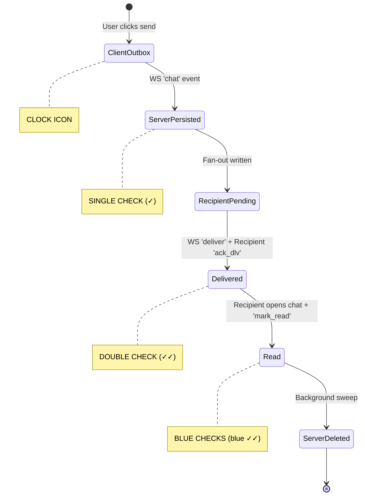

# System Design: Offline Message Delivery

## 1. Problem Statement

The core problem is the **Mailbox Problem** (Offline Message Delivery). Mobile devices frequently lose connectivity, switch networks, or die. If Alice sends a message to Bob, and Bob's phone is currently disconnected, the system cannot drop the message. It must reliably hold the message in a durable "mailbox" and deliver it the instant Bob reconnects, in the correct order, without duplicating it.

## 2. How WhatsApp Does It

WhatsApp pioneered the modern mobile messaging paradigm using Erlang and a custom protocol (originally based on XMPP).
- **Store-and-Forward**: Messages are stored server-side only until delivered.
- **Persistent TCP**: Clients maintain a long-lived TCP socket to Erlang gateways.
- **The Send Flow**: 
  1. Client writes to Outbox, sends to Server.
  2. Server persists to Mailbox.
  3. Server ACKs sender (one check mark).
  4. Server pushes to recipient (if online) or leaves in Mailbox.
- **Ack Stages**:
  - `Clock`: Local outbox, not yet on server.
  - `✓` (Single Gray Check): Server has it.
  - `✓✓` (Double Gray Check): Recipient device received it.
  - `blue ✓✓` (Double Blue Check): Recipient read it.
- **Server Mailbox & 30-Day TTL**: Once a message is delivered to all target devices, it is aggressively deleted from the server. If undelivered for 30 days, it is swept.

## 3. What We Simplify

| Feature | Real WhatsApp | Our Project |
| :--- | :--- | :--- |
| **Protocol** | Custom Noise Pipes / TCP | WebSockets (JSON payloads) |
| **E2E Encryption** | Signal Protocol | Omitted for teaching clarity |
| **Media/Files** | Complex blob storage & CDNs | Text-only messages |
| **Database** | Mnesia (Erlang) / FreeBSD | SQLite (Shared WAL) |
| **Multi-Device** | Complex device syncing logic | Single device per user |

## 4. Our Architecture

```mermaid
flowchart TD
    subgraph Layer 5: Load Balancing
        LB[Caddy]
    end

    subgraph Layer 4: Gateways (Go)
        GW1[Gateway Node 1]
        GW2[Gateway Node 2]
    end

    subgraph Layer 3: Use Cases
        UC[Clean Architecture Use Cases]
    end

    subgraph Layer 2: Ephemeral State
        Redis[(Redis: Presence & Pub/Sub)]
    end

    subgraph Layer 1: Durable State
        SQL[(SQLite: WAL Mode)]
    end

    LB --> GW1
    LB --> GW2
    GW1 --> UC
    GW2 --> UC
    UC --> Redis
    UC --> SQL
```

## 5. Data Ownership

| Concern | Datastore | Why |
| :--- | :--- | :--- |
| **Durable Messages** | SQLite | ACID compliance, transactional integrity, single source of truth for undelivered mail. |
| **Presence (Global)**| Redis | Ephemeral by nature. Fast TTLs (30s) allow the system to self-heal when gateways crash. |
| **Routing / Fan-out**| Redis Pub/Sub | Cross-gateway messaging requires high-throughput, low-latency publish/subscribe mechanisms. |
| **Local Connections**| In-Memory | WebSockets are physical TCP sockets tied to a specific gateway's memory space. |

## 6. SQLite Schema

| Table | Columns | Notes |
| :--- | :--- | :--- |
| `users` | `id, username, created_at` | Global user directory. |
| `devices` | `id, user_id, public_key, last_seen` | Hardware identity. FK to users. |
| `groups` | `id, name, created_at` | Group chats metadata. |
| `group_members`| `group_id, user_id, role` | Defines who receives fan-out group messages. |
| `messages` | `id, sender_device_id, payload, created_at` | The raw message payload (write once). |
| `deliveries` | `id, message_id, recipient_device_id, status, updated_at`| The fan-out edge. Status: `pending`, `delivered`, `read`. |

## 7. WebSocket Protocol

| Type | Direction | Payload Structure / Purpose |
| :--- | :--- | :--- |
| `auth` | C → S | `{ device_id, token }` Handshake. |
| `chat` | C → S | `{ id, group_id, text }` Send message. |
| `ack_srv` | S → C | `{ message_id }` Server confirms persistence (✓). |
| `deliver` | S → C | `{ message_id, text, sender }` Push message to recipient. |
| `ack_dlv` | C → S | `{ message_id }` Recipient confirms receipt. |
| `ack_rcpt`| S → C | `{ message_id, status }` Notifies sender of (✓✓) or (blue ✓✓). |
| `ping` | C → S | Heartbeat. |
| `pong` | S → C | Heartbeat response. |

## 8. Message Lifecycle



## 9. Scalability Path

The Clean Architecture directly facilitates the multi-node scale-out introduced in Episode 3. 
By cleanly separating the `ConnectionRegistry` (Adapter) from the `SendMessage` (Use Case), we were able to seamlessly introduce a Redis Event Bus implementation of the `EventBus` port. The Use Case simply tells the Bus to deliver the message. In Episode 1, the Bus was an in-memory channel. In Episode 3, we swap it for a Redis Pub/Sub adapter, instantly transforming the monolithic design into a distributed, horizontally scalable chat cluster without changing a single line of domain or business logic.
